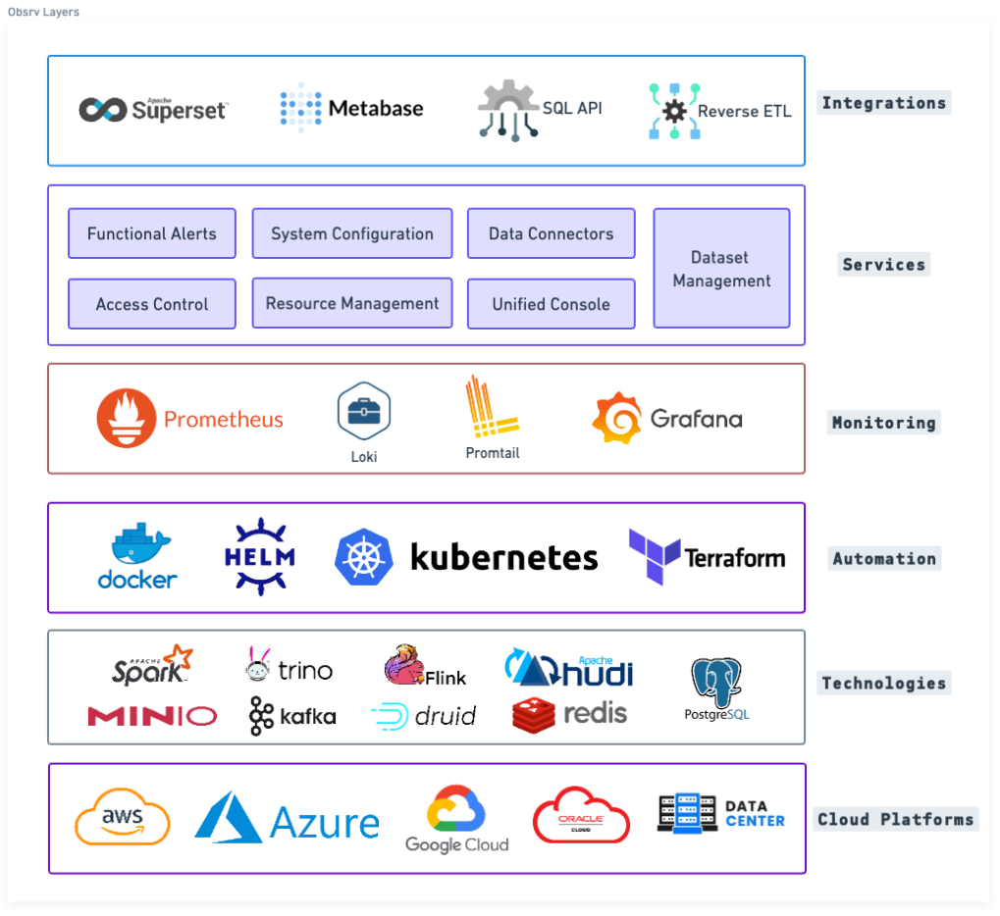
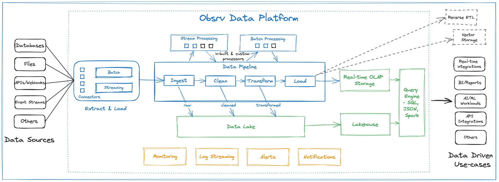

# High Level Architecture

Obsrv fuses multiple technologies together with extreme automation and detailed monitoring coupled with intelligent services to work on any cloud to enable multiple data use-cases via decoupled integrations. The chaining together of these layers give Obsrv its scalability, reliability and efficiency.

<figure><figcaption>
Obsrv in a box - Fuse together multiple layers
</figcaption></figure>

Following diagram explains the high level architecture of the Obsrv data platform

<figure><figcaption>
Obsrv Data Platform
</figcaption></figure>

Following are the key components in Obsrv:

1. **Connectors:** A connector (that can be literally dropped in) has the ability to pull the data from any source either as a stream/event or batch. The connector framework of Obsrv allows one to develop a connector quickly within a couple of days using popular technologies like Apache Spark and Apache Flink and in the language of their choice - java/scala/python. By design the framework takes care of scaling and reliability of the connectors
2. **Data Pipeline:** Data pipelines are Apache Flink and Apache Spark based jobs that are designed to process data at real-time speed. The data pipeline of Obsrv is extremely elastic and scales from 1 cpu to many cpus with minimal configuration changes and is also customizable and/or extendable.
3. **Real-time OLAP Store:** If configured, all the data is persisted in a real-time OLAP store called Apache Druid that would drive all real-time use-cases.
4. **Data Lake and LakeHouse:** As a default configuration, all data is persisted into a data lake (like S3 object store) and a LakeHouse called Apache Hudi. The LakeHouse and data lake drive the exhaust, AI/ML queries, batch aggregate queries and reporting needs.
5. **Unified Query Engine:** The unified query engine component takes care of all data driven use-cases. It allows the user to query using JSON, SQL and Spark/Trino interfaces.
