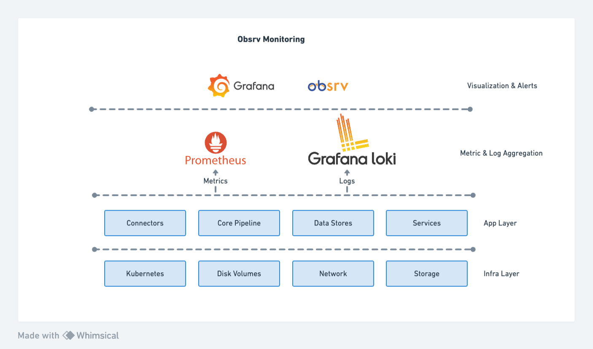

# Monitoring

Obsrv offers a robust monitoring system to monitor the performance and health of the entire system. The infrastructure, application and service components are all configured to emit metrics and logs. Obsrv uses Prometheus as the default metric aggregation system and Grafana Loki as the default log aggregation system from various components.

<figure><figcaption>
Obsrv Monitoring Stack
</figcaption></figure>

### Infrastructure Health and Usage 

Obsrv provides a way to monitor the health and usage of three main aspects of the entire infrastructure, viz. This provides the capability to analyze and intelligently optimize the infrastructure usage according to the workloads in the cluster.

1. CPU usage
2. Disk usage
3. Memory usage

### Observability Segregation 

Obsrv provides an ability to categorize the various infrastructure and application services based on functionality such as Ingestion, Processing, Storage and Querying. This categorization helps in aggregation of metrics at various functional component levels and helps in providing an easy and insightful way for the operations team to understand incidents or performance degradation.

### Full Text Search on Logs 

Debuggability and traceability are important tools to ensure a non-intrusive way to understand application failures. Obsrv provides an ability to seamlessly search for errors encountered in various applications and services. Obsrv aggregates logs from multiple services using Promtail and Grafana Loki and provides a unified interface on Grafana to perform analysis on logs and understand failures.
