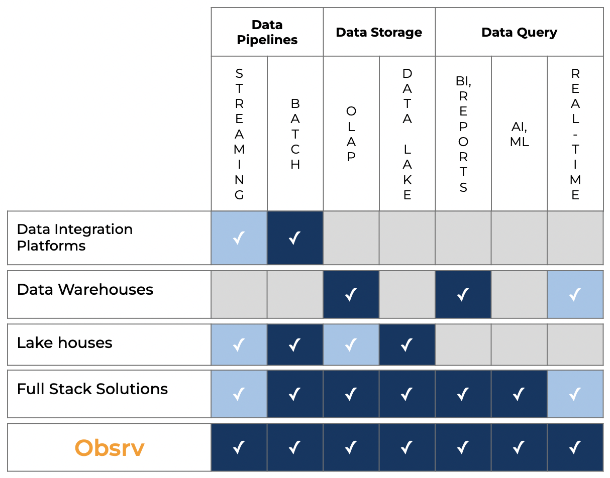

# Obsrv Overview

As touched upon in the introduction section, A data value chain consists of ingesting & processing of data via data pipelines, storage of the processed data in a data-warehouse or data lake, and querying of the data for analytical purposes. The querying of data is either via a batch request or real-time depending upon the underlying storage layer configured.

Therefore many tools and technologies have come up in this space (see diagram below) trying to solve very specific problems as listed below:

1. **Data Integration Platforms:** Data integration platforms (and tools) are used to move the data from operational sources (like OLTP databases, object stores, log streams) be it structured, semi-structured or unstructured into a data store where further processing and querying can happen. Some of the integration platforms also provide the ability to transform the data while moving into the data platform. This movement is either batch or streaming depending on the sources themselves.
2. **Data Warehouses:** Data warehouses are used to store the data in the format that is friendly for analytical queries. Typical analytical queries crunch large amounts of data on any dimension depending on user needs. Typical OLTP databases cannot support these kinds of adhoc and interactive querying needs.
3. **Lake Houses:** While data warehouses are present for storage, most of them support only structured data. In addition, data warehouses have strong schema affinity which make them very slow to adapt for changing needs. For ex: what if new attributes are added to the data? It is huge engineering work to prepare them to be stored in a data warehouse. In addition data warehouses are not AI/ML friendly or efficient. Lake-houses are an evolved architecture pattern to handle the limitations of data warehouses while providing cheap storage (as they are built on top of data lakes) and efficient and fast querying capabilities to AI/ML algorithms.
4. **Full-stack solutions:** While there are many tools, to realize an end-to-end data value chain, many tools have to be stitched together to get an usable data platform. While the tools are scalable by themselves, architecturally ensuring reliability of each tool is a challenge and when stitched together the complexity increases exponentially. There are many full-stack solutions that have tried to solve this problem by providing all the capabilities of data integration tools, data warehouses and lake-houses.

While full-stack solutions themselves offer a complete solution, almost all of them are not built as real-time solutions ground up and are neither open-sourced.

As explained in the diagram below, this is the reason why Obsrv has been built - fully open source, stitching together the best tools for pipelines, storage and querying and real-time first by design.

<figure><figcaption>
Capability Landscape
</figcaption></figure>
