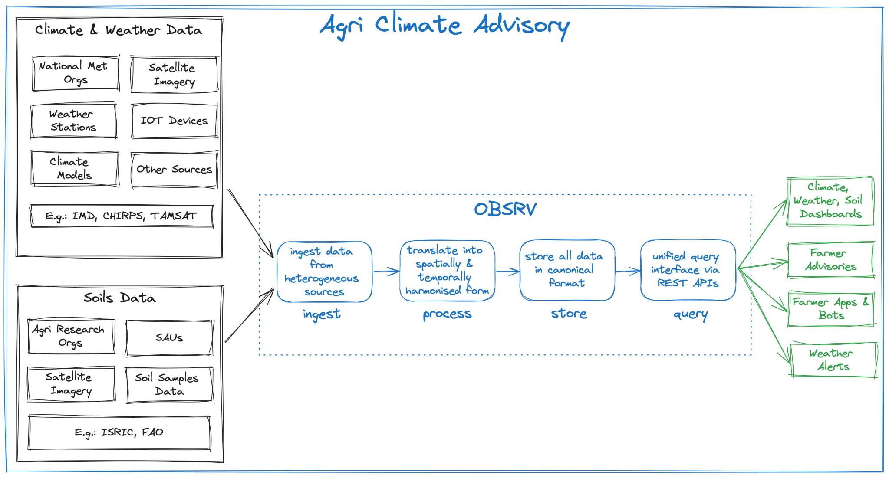

# Agri Climate Advisory

Climate variability is a major source of risk to food production as well as to the livelihoods of small and marginal farmers. With other biophysical, socio-economic, and political factors, climate risk contributes enormously to food insecurity, economic losses, and poverty. Climate information services (CIS) can help farmers and food systems mitigate some of these risks as well as build resilience to climate shocks. Research indicates that farmers place value on location and crop specific weather and climate-based agriculture advisories that support farmers in making key decisions while minimizing climate and weather induced risks. Agri-meteorologists play a pivotal role in interpreting climate data and translating it into contextual actionable insights for farmers. However, the effectiveness of their advisories heavily relies on the quality, accessibility, and timeliness of data. Receiving climate information, especially of impending weather events, can help agri-meteorologists recommend pre-emptive actions to farmers and minimize their crop production losses from weather and climate induced events.

In an era where climate change poses unprecedented challenges to agriculture, harnessing data-driven insights becomes crucial for sustainable and productive farming practices. This case study explores how OBSRV enables agri-meteorologists to deliver context-rich advisories to farmers, enhancing agricultural resilience and productivity.

### **The Challenge** 

Traditionally, accessing and processing diverse climate and soil data from multiple sources posed significant challenges:

* **Data Heterogeneity**: Climate and soil data often originate from disparate sources, such as meteorological departments, global weather datasets, satellite imagery, and soil databases, presenting in different formats.
* **Spatial and Temporal Discrepancies**: Data collected from various sources may exhibit spatial and temporal discrepancies, complicating the harmonization process.
* **Accessibility and Interpretation**: Agri-meteorologists require easily accessible and interpretable data to formulate relevant advisories for farmers.

### **Use Case: Climate-Based Agriculture Advisory** 

In the context of climate-based agriculture advisory, OBSRV facilitates the following processes:

* **Data Acquisition**: OBSRV ingests climate and soil data from multiple sources such as meteorological departments, global weather datasets, satellite imagery providers, and soil databases.
* **Data Harmonization**: The platform harmonizes diverse datasets, aligning them spatially and temporally to ensure consistency.
* **Data Analysis**: Agri-meteorologists leverage OBSRV's analytical capabilities to analyze climate trends, identify risk factors, and forecast agricultural outcomes.

<figure><figcaption></figcaption></figure>

Based on data insights, agri-meteorologists craft context-rich advisories and disseminate them to farmers through various channels, including mobile applications, SMS alerts, and web portals.

### **Benefits** 

The adoption of OBSRV for climate-based agriculture advisory yields the following benefits:

* **Enhanced Decision-Making**: Agri-meteorologists make informed decisions backed by data-driven insights, optimizing agricultural practices and mitigating risks.
* **Improved Resilience**: Farmers receive timely and relevant advisories, enabling them to adapt to changing climatic conditions and minimize yield losses.
* **Resource Optimization**: Precise advisories help farmers optimize resource utilization, including water, fertilizers, and pesticides, leading to cost savings and environmental sustainability.
* **Knowledge Exchange**: OBSRV fosters knowledge exchange and collaboration among agri-meteorologists, researchers, and farmers, promoting innovation and resilience in agriculture.
* **Scalability and Flexibility**: OBSRV is designed to scale according to evolving data needs and can accommodate new & additional data sources and functionalities.

OBSRV is a transformative solution for climate-based agriculture advisory, empowering agri-meteorologists to harness the power of data for informed decision-making. By facilitating the ingestion, harmonization, and accessibility of diverse climate and soil data, OBSRV enables agri-meteorologists to provide context-rich advisories that enhance agricultural resilience, productivity, and sustainability.
