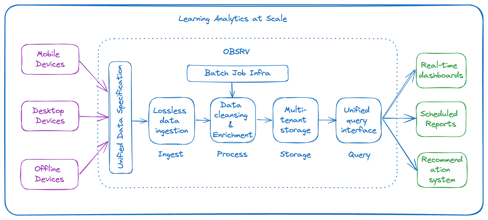

# Learning Analytics at Population Scale

In the rapidly evolving landscape of education, analytics has emerged as a pivotal tool for learning platforms at scale, ushering in a transformative era of data-driven insights. As the demand for online learning experiences continues to grow, the importance of analytics in educational platforms becomes increasingly evident. Analytics not only provides a comprehensive view of learner engagement and performance but also empowers educators and administrators with the ability to make informed decisions. Through the systematic analysis of vast datasets, learning platforms can personalize content, identify patterns of student behavior, and optimize the overall learning experience.&#x20;

This case study explores how OBSRV enabled a population scale learning platform like DIKSHA to provide a means for students to access educational content remotely and offered teachers a digital repository of learning resources and teaching material to facilitate remote instruction,  ensuring continuity in learning during the recent pandemic.

## The Challenge

Any learning analytics system which aims at gathering insights into interactions, engagement, and performance to enhance educational outcomes are faced with multifaceted challenges.

* **Scalability**: Ensuring that systems can handle increasing data volumes and user interactions without compromising performance is a persistent challenge.
* **Data Privacy and Security**: Protecting the anonymity of the user data and ensuring proper access controls are present in the system for multi-tenant access.
* **Data Accessibility**: Educators need to have an easy and efficient way of accessing historical data and understand the lineage to come up with specific learning objectives.

<figure><figcaption>
Learning Analytics at Scale
</figcaption></figure>

## Benefits

* **Reliability at Scale**: Educators can make informed decisions in real-time and change the learning plan as Obsrv ensures reliability at scale while processing huge volumes of data.
* **Lossless data processing**: Obsrv ensures that the client systems always get an acknowledgment to ensure the data ingestion and processing are lossless.
* **Data Transparency**: Obsrv enabled the teachers to have transparent access to the learning data to understand and personalize learning paths for various students.
* **Scalability**: DIKSHA’s mission was to reach 200 million children with basic learning experiences and Obsrv delivered effortlessly with 5 million Daily Active Users and processing 2 billion data points a day at peak.

\

\
