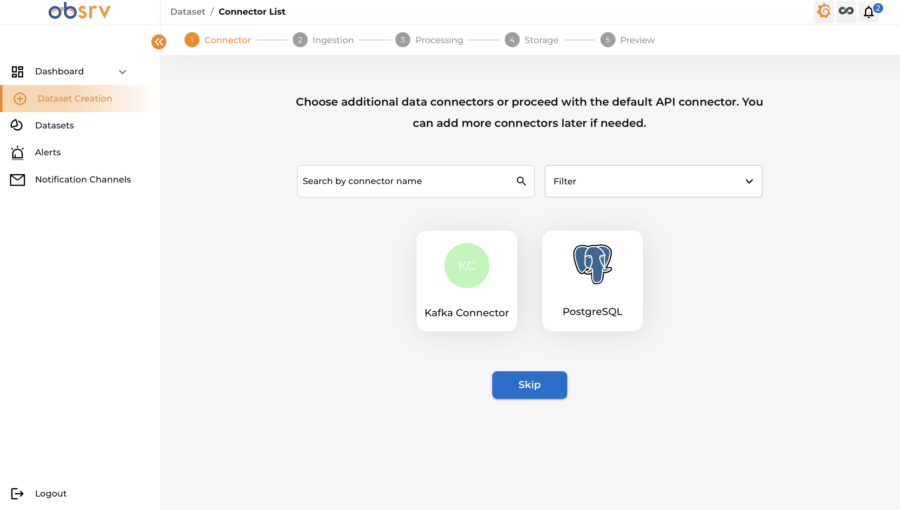
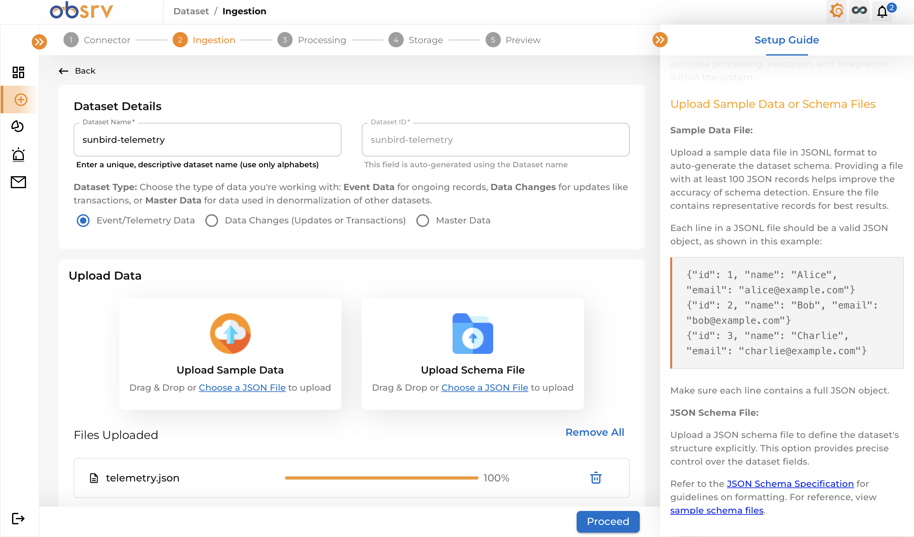
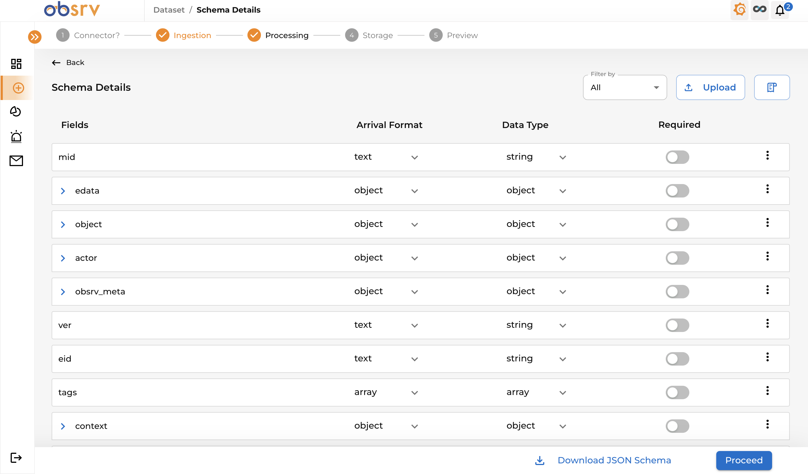
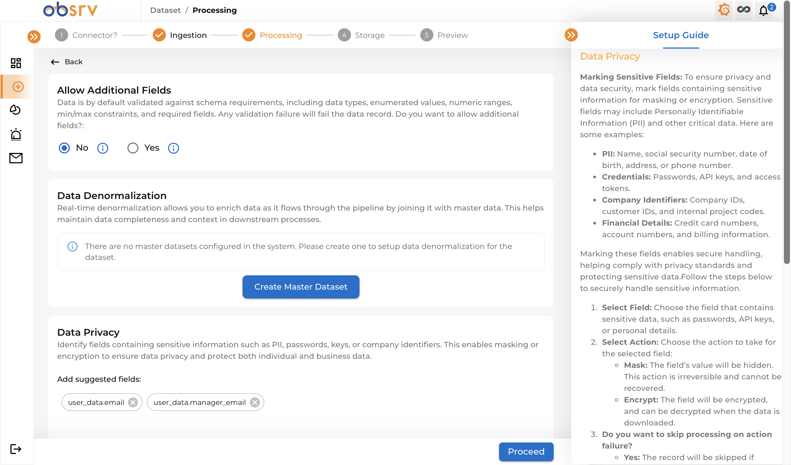
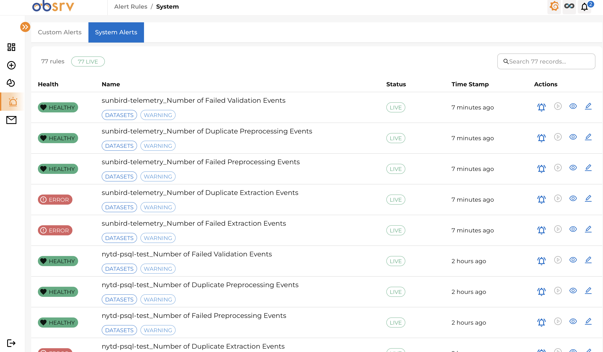
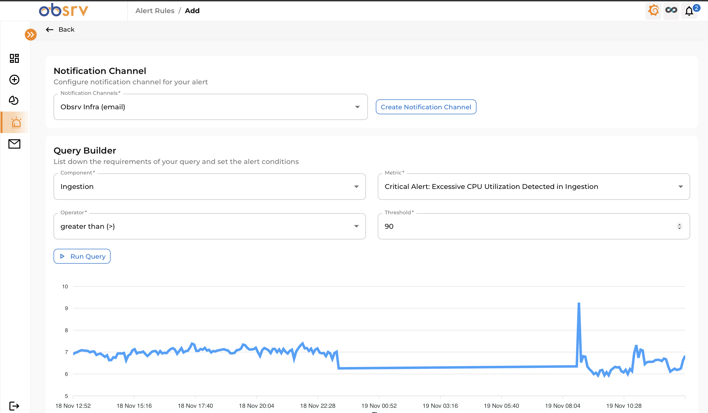
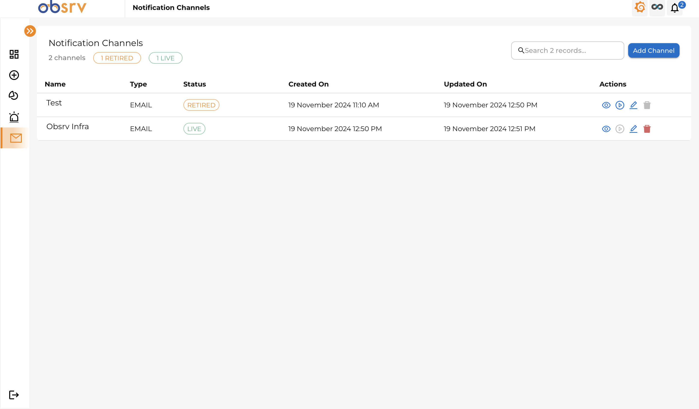
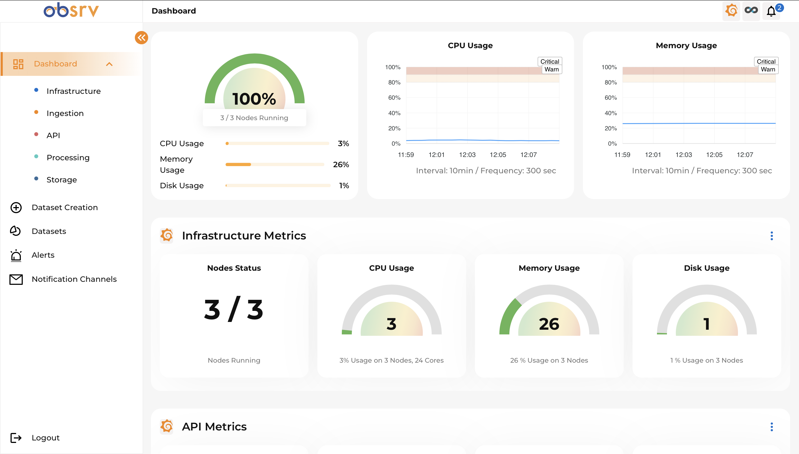
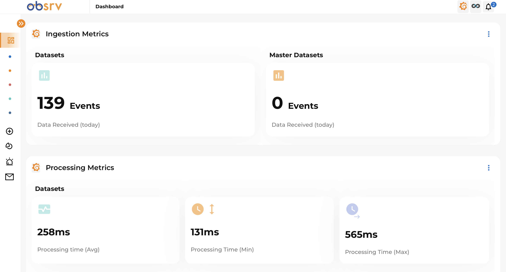
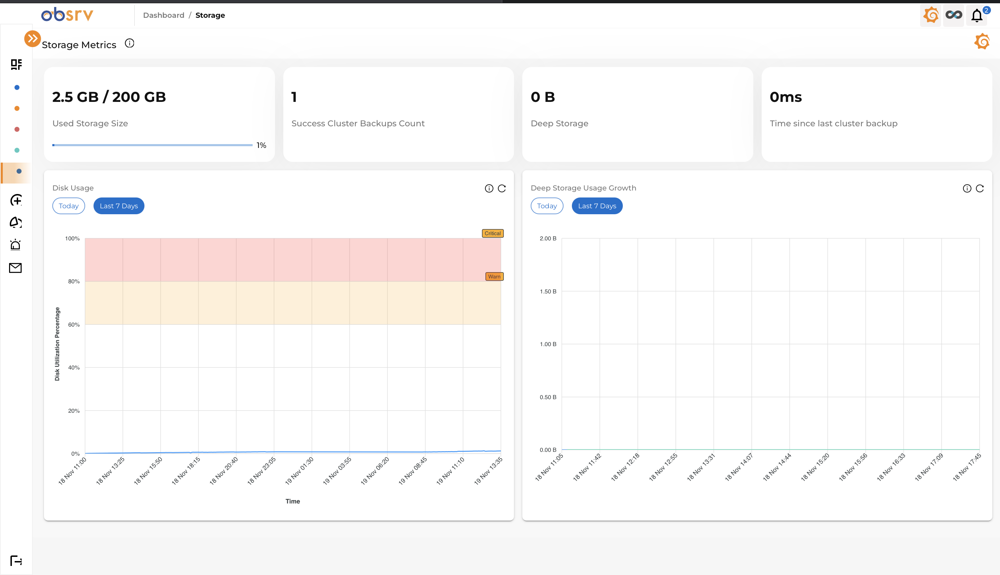

# Management Console

The **Management Console** is a sophisticated and intuitive platform designed to give you complete control over your datasets, connectors, and system operations. With a user-friendly interface, it streamlines the processes of dataset creation, configuration, and monitoring, while offering advanced features for data transformation, health monitoring, and alert management. Built-in metrics and real-time dashboards provide a comprehensive overview of your system's performance, ensuring efficient and seamless data workflows.

---

## Key Features

- **Dataset Management**: Create, update, and organize datasets with ease.  
- **Connector Configuration**: Integrate connectors effortlessly to enable automatic data synchronization between sources and destinations.  
- **Data Transformation**: Apply advanced transformations, including masking, encryption, and JSONAT, to ensure data privacy and compliance.  
- **Dataset Joining**: Link datasets with master datasets to enrich data analysis capabilities.  
- **Duplicate Record Removal**: Ensure data integrity by identifying and removing duplicate records.  
- **System Monitoring**: Access real-time dashboards and metrics for monitoring system performance and health.  
- **Custom Alerts**: Configure alerts and notifications to proactively manage dataset and connector issues.  

---

## Accessing the Management Console

To use the **Management Console**, navigate to the configured **ingress URL** or use port forwarding to access the application. Log in using the default credentials:  
- **Username**: `obsrv_admin`  
- **Password**: `enDoPvTAxFSd`  

Upon logging in, you can explore the extensive features for managing data workflows, transforming data, and monitoring system health.

---

## Key Workflows in the Management Console

### **Datasets Creation**  
The Management Console provides a streamlined workflow for creating datasets.  

### **1. Connectors**  
Manage and configure connectors for seamless data integration.  

1. Register connectors via API and view them in the console.  
2. Explore default open-source connectors such as JDBC, Kafka, Object Store, and Knowlg.  
3. Add custom connectors to meet specific requirements.  
4. During dataset creation, select and configure the appropriate connector by filling in the required details.  

<figure><figcaption>
Connectors List Page
</figcaption></figure>
<figure><figcaption>
Connector Detailed Page
</figcaption></figure>

---

### **2. Provide Basic Information**  
1. Enter the name of the dataset.  
2. Upload a sample data file or schema file if available.  

<figure><figcaption>
Dataset Creation
</figcaption></figure>

---

### **3. Ingestion Configuration**  
1. Review the schema configuration and make modifications if needed.  
2. Resolve any data type conflicts automatically with recommendations provided by the console.  

<figure><figcaption>
Ingestion Configuration
</figcaption></figure> 

---

### **4. Processing Configuration**  
1. Choose the schema evaluation type.  
2. Apply data transformations like masking and encryption for PII fields.  
3. Automatically detect and address data type conflicts.  
4. Enable settings to prevent duplicate record ingestion.  

<figure><figcaption>
Processing Configuration
</figcaption></figure> 

---

### **5. Storage Configuration**  
1. Configure storage type, such as lakehouse or real-time OLAP storage.  
2. Set up storage configurations, including partition keys, timestamp keys, and primary keys.  

Once all sections are configured, review the dataset settings and publish the dataset to make it live.  

<figure><figcaption>
Storage Configuration
</figcaption></figure> 

---

### **6. Dataset Management**  
1. View all datasets with their status, metrics, and health information on a consolidated list.  
2. Click on a dataset to view its detailed configuration and insights.  
3. Retire unused datasets to maintain an organized environment.  

*(Insert image link here)*  

---

## Alerts and Notifications

1. Create custom alerts to monitor specific events related to datasets and connectors.  
2. Set up notifications for events, ensuring timely action when needed.  
3. Configure alerts to notify you via channels like Slack, email, and Discord for real-time updates.  

<figure><figcaption>
Infra Alerts
</figcaption></figure> 
<figure><figcaption>
Custom Alerts
</figcaption></figure> 
<figure><figcaption>
Notification Channels
</figcaption></figure> 

---

## Dashboards  

1. Monitor the overall system health with infra cluster and health dashboards.  
2. Gain insights into ingestion, processing, storage, and querying workflows through dedicated dashboards.  

<figure><figcaption>
Infra Metrics
</figcaption></figure> 
<figure><figcaption>
Ingestion Metrics
</figcaption></figure> 
<figure><figcaption>
Storage Metrics
</figcaption></figure> 
<figure><figcaption>
Processing Metrics
</figcaption></figure> 

---

The **Management Console** empowers you to manage your datasets, ensure data integrity, monitor system performance, and stay proactive with alerts and notifications—all in one streamlined interface.