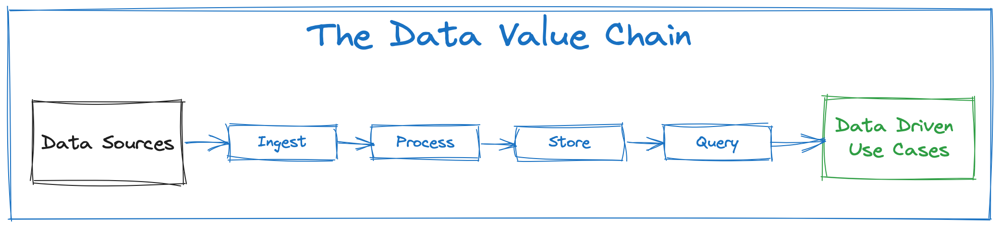
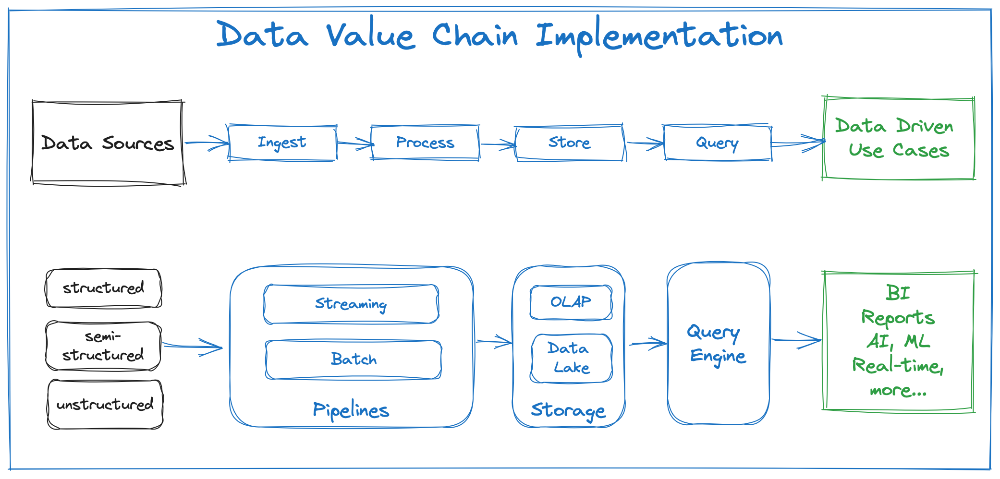

# Data Value Chain

The Data Value Chain represents the journey of data from its raw form to actionable insights and strategic decision-making. The data value chain typically encompasses the stages shown in the below diagram:

<figure><figcaption>
Stages of Data Value Chain
</figcaption></figure>

Efficient management of the Data Value Chain is crucial for all companies seeking to derive maximum value from their data. The figure below shows the typical technology components used in implementing a data value chain.

<figure><figcaption>
Typical Technology Components in a Data Value Chain
</figcaption></figure>

> ### _<mark style="color:blue;">**There is growing demand for a robust data value chain in organizations seeking to extract maximum value from their data…**</mark>_
