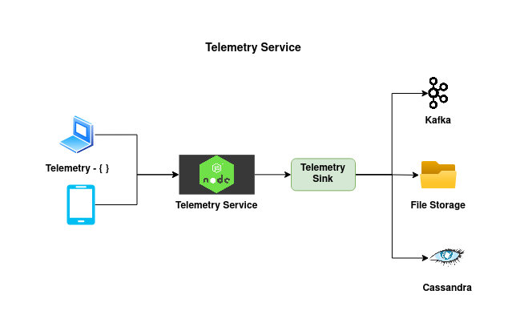

# Telemetry Service

Telemetry Service is a highly scalable micro service which allows various components in the Sunbird platform to send the event level data generated from various activities in the platform. These event level data could be either from clients such as the user apps or from micro services such as Sunbird Lern.

#### Key Features:

1. Horizontally Scalable: The service can be scaled horizontally to handle increase in Telemetry data traffic as the operations are idempotent.
2. Configurable storage: The service supports disk storage, Apache Kafka, Apache Cassandra as data storage.
3. In-built compression: Efficient use of network bandwidth by compressing the messages sent to the data storage.

#### Installation Configuration Reference:

| Property            | Description                                                                                         | Default                               |
| ------------------- | --------------------------------------------------------------------------------------------------- | ------------------------------------- |
| localStorageEnabled | A boolean flag to enable on disk storage                                                            | true                                  |
| dispatcher          | Supported dispatchers are kafka, cassandra, file and console                                        | console                               |
| kafkaHost           | Host or IP address of the Kafka broker servers                                                      | none                                  |
| topic               | The kafka topic to which telemetry data will be pushed to                                           | none                                  |
| compression\_type   | Type of compression to use if kafka dispatcher is chosen. Possible values are none, gzip and snappy | none                                  |
| filename            | The name of the file to write data to if file dispatcher is chosen                                  | telemetry-%DATE%.log                  |
| maxSize             | Roll over max size for file based dispatched                                                        | 100 Mb                                |
| maxFiles            | Max files to keep for a file based dispatcher                                                       | 100                                   |
| partitionBy         | Time based partitioning key for a Cassandra dispatcher                                              | hour                                  |
| keyspace            | Keyspace name for a Cassandra dispatcher                                                            | none                                  |
| cassandraTtl        | TTL for retention of data for a Cassandra dispatcher                                                | none                                  |
| threads             | Number of cpu threads to be used by the service                                                     | Default number of cpus on the machine |


Telemetry documentation [telemetry.sunbird.org](http://127.0.0.1:5000/o/-Mi9QwJlsfb7xuxTBc0J/s/-MkM7F4oILSpCJPO0YUu/)



Source Code

